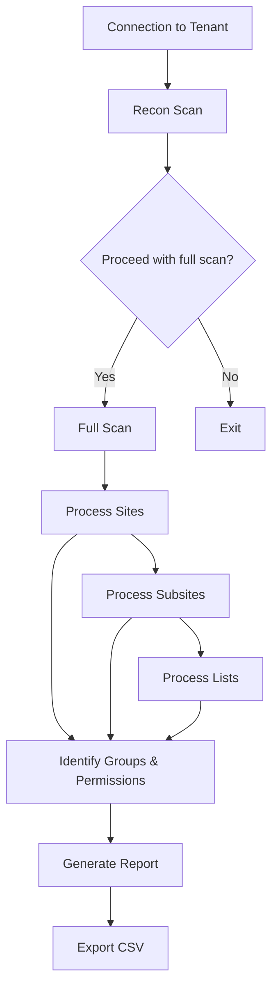

# 🔍 SharePoint Entra Group Permissions Reporter

[](https://github.com/PowerShell/PowerShell)
[](https://pnp.github.io/powershell/)
[](https://opensource.org/licenses/MIT)

A comprehensive PowerShell tool for reporting Microsoft 365 (Entra ID) groups and security groups assigned to SharePoint sites, subsites, and lists.

<div align="center">
  
  
  
</div>

## 📋 Table of Contents

- [Purpose](#-purpose)
- [Features](#-features)
- [Prerequisites](#-prerequisites)
- [Installation](#-installation)
- [Usage](#-usage)
- [How It Works](#-how-it-works)
- [Output Explanation](#-output-explanation)
- [Troubleshooting](#-troubleshooting)
- [Limitations](#-limitations)
- [License](#-license)

## 🎯 Purpose

During tenant migrations, understanding how groups are applied across your SharePoint environment is critical. This script helps migration teams and administrators to:

- **Discover** all Microsoft 365 Groups, Security Groups, and SharePoint Groups with site permissions
- **Identify** where these groups have access in your SharePoint environment
- **Document** permission levels assigned to each group
- **Generate** reports that can inform your migration strategy and security governance

## ✨ Features

| Feature | Description |
|---------|-------------|
| 🔍 **Comprehensive Discovery** | Scans site collections, subsites, and lists with unique permissions |
| 🏷️ **Group Classification** | Correctly identifies different group types (M365 Groups, Security Groups, SharePoint Groups) |
| 🔐 **Permission Mapping** | Reports which permission levels are assigned to each group |
| ⚡ **Recon Mode** | Provides a quick overview of the environment size before performing the full scan |
| 🧪 **Test Mode** | Allows testing against a single site before scanning the entire tenant |
| 📊 **Visual Progress** | Uses color-coded output and progress bars to track scanning progress |
| 📂 **CSV Export** | Exports detailed findings for documentation and further analysis |
| 🔄 **Nested Group Detection** | Identifies Entra ID groups nested inside SharePoint groups |
| 🛡️ **System Principal Filtering** | Excludes system principals from reports for cleaner output |

## 📋 Prerequisites

- PowerShell 5.1 or higher
- [PnP.PowerShell](https://pnp.github.io/powershell/) module installed
- An app registration in Azure AD with the following permissions:
  - **Microsoft Graph API**: `Sites.Read.All`, `Group.Read.All`
  - **SharePoint**: `Sites.FullControl.All`
- An account with read access to all SharePoint sites in the tenant

## 💻 Installation

1. Install the PnP PowerShell module if you haven't already:

```powershell
Install-Module -Name "PnP.PowerShell" -Force
```

2. Download the `Report-EntraGroupPermissions.ps1` script to your local machine.

3. Ensure you have your Azure AD App Registration ClientID ready.

## 🚀 Usage

1. Run the script in PowerShell:

```powershell
.\SharePoint-EntraGroupsScanner-Full.ps1
```

2. When prompted, enter:
   - Your ClientID (Application ID) from your Azure AD App Registration
   - Your tenant admin URL (e.g., `https://yourtenant-admin.sharepoint.com`)

3. The script will first perform a recon scan to count site collections, subsites, and lists.

4. After reviewing the recon scan results, choose whether to proceed with the full scan.

5. Optionally enable test mode to scan just a single site.

6. Review the results in the console, including:
   - A summary of discovered group assignments
   - A breakdown of group types found

7. Optionally export the detailed findings to a CSV file.

## ⚙️ How It Works

The script operates in several phases:



1. **Connection**: Uses PnP PowerShell to connect to your tenant admin site with your provided ClientID.

2. **Recon Scan**: Quickly counts all site collections, subsites, and lists in your environment to give you an overview of the scope.

3. **Full Scan (if approved)**: 
   - Processes each site collection in the tenant (excluding OneDrive sites)
   - For each site, retrieves all role assignments and identifies group principals
   - Examines lists with unique permissions to find group assignments
   - Recursively processes all subsites using the same approach
   - Collects information about the groups, their types, and permission levels
   - Inspects SharePoint groups to find nested Entra ID groups

4. **Reporting**: Provides a color-coded summary of findings in the console and optionally exports detailed data to CSV.

## 📝 Output Explanation

The script generates a report with the following information:

| Field | Description |
|-------|-------------|
| **WebUrl** | The URL of the site or subsite where the group has permissions |
| **WebTitle** | The title of the site or subsite |
| **ObjectType** | Whether this is a Site, Subsite, or List (with list name) |
| **GroupName** | The display name of the group |
| **GroupType** | The type of group (M365/EntraIDGroup, SecurityGroup, SharePointGroup, etc.) |
| **LoginName** | The internal login name of the group, which helps identify the group type |
| **Permissions** | The permission levels assigned to the group (e.g., "Full Control; Design; Edit") |
| **IsSystemPrincipal** | Indicates if this is a system principal (excluded from summary display) |
| **SharePointGroupContainer** | If the group is nested within a SharePoint group, this shows the container group name |

## 🔧 Troubleshooting

### Common Issues:

<details>
<summary><b>Authentication Failed</b></summary>
<ul>
<li>Ensure your App Registration has the correct permissions</li>
<li>Check that the ClientID is entered correctly</li>
<li>Make sure you have access to the tenant admin site</li>
</ul>
</details>

<details>
<summary><b>Script Runs Slowly</b></summary>
<ul>
<li>The script processes every site, subsite, and list with unique permissions</li>
<li>Large tenants may take significant time to process</li>
<li>Consider using test mode on a subset of sites first</li>
</ul>
</details>

<details>
<summary><b>Missing Groups</b></summary>
<ul>
<li>If groups aren't appearing in the report, check if they're actually assigned directly to sites</li>
<li>Some groups might be nested within SharePoint groups</li>
<li>The script will detect Entra ID groups inside SharePoint groups and include them in the report</li>
</ul>
</details>

<details>
<summary><b>"ClientObject is null" Errors</b></summary>
<ul>
<li>This can happen if there are connection issues</li>
<li>The script handles this by creating a fresh connection for each site</li>
<li>Check network stability and permissions</li>
</ul>
</details>

## ⚠️ Limitations

- The script doesn't report on individual user permissions, only groups
- Nested group memberships beyond the first level are not expanded (e.g., if a Security Group is a member of another Security Group)
- Performance may be affected in very large tenants with thousands of sites
- The script doesn't report item-level permissions, only site, subsite and list-level permissions

## 📄 License

This script is provided "as is" without warranty of any kind, either expressed or implied.

---

**Note**: Always test scripts in a non-production environment before running them against your production tenant.
